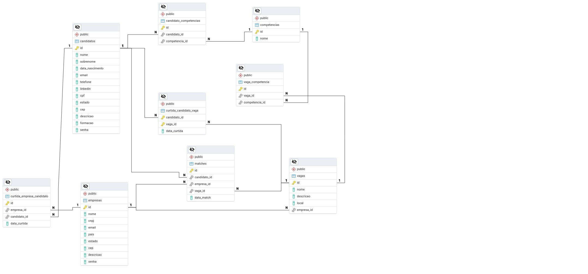

# LinkeTinder (BACKEND) - Autor: Daniel Costa - ACZG 6.0

Linketinder é uma aplicação Groovy que permite a interação entre candidatos e empresas, e promete revolucionar o método como são realizadas as contratações de novos colaboradores, esta aplicação está sendo desenvolvida como um dos projetos do ACZG 6.0.

## API REST v1

<details>

<summary>Documentação</summary>


**GET**
**empresasas**

- http://localhost:8080/api/v1/empresas
- http://localhost:8080/api/v1/empresas/{id}

**candidatos**
- http://localhost:8080/api/v1/candidatos
- http://localhost:8080/api/v1/candidatos/{id}

**vagas**
- http://localhost:8080/api/v1/vagas
- http://localhost:8080/api/v1/vagas/{id}

**competencias**
- http://localhost:8080/api/v1/competencias
- http://localhost:8080/api/v1/competencias/{id}

**POST**
**empresas**

- http://localhost:8080/api/v1/empresas


    {
        "nome": "Empresa Exemplo 3",
        "email": "contaskjkjko@emprsessaesxemplo.com",
        "estado": "SP",
        "cnpj": "12345558150109",
        "pais": "Brasil",
        "cep": "12345678",
        "descricao": "Empresa de desenvolvimento de software personalizado",
        "senha": "1234abcd"
    }

**candidatos - ok**
http://localhost:8080/api/v1/candidatos

    {
        "nome": "João",
        "sobrenome": "Silva",
        "email": "joao@example.com",
        "telefone": "+55 11 91234-5678",
        "linkedin": "https://www.linkedin.com/in/joao-silva",
        "cpf": "143.436.729-00",
        "dataNascimento": "1990-05-15",
        "estado": "SP",
        "cep": "12345-678",
        "descricao": "Profissional experiente em desenvolvimento de software com foco em soluções escaláveis.",
        "formacao": "Engenharia de Software",
        "senha": "senhaSegura123"
    }

**vagas - ok**

http://localhost:8080/api/v1/vagas

    {
        "empresaId": "5",
        "nome": "Desenvolvedor Backend",
        "descricao": "Responsável pelo desenvolvimento de APIs RESTful e integrações com serviços externos.",
        "local": "Remoto"
    }

**competencias - ok**

http://localhost:8080/api/v1/competencias

    {
        "vagaId": "4",
        "competencias": "COMPETENCIA, COPA, LOVE, aaa"
    }

**PUT**
**empresas - ok**

http://localhost:8080/api/v1/empresas/{id}

    {
        "nome": "Empresa Exemplo 3",
        "email": "contaskjkjko@emprsessaesxemplo.com",
        "estado": "SP",
        "cnpj": "12345558150109",
        "pais": "Brasil",
        "cep": "12345678",
        "descricao": "Empresa de desenvolvimento de software personalizado",
        "senha": "1234abcd"
    }

**candidatos - ok**

http://localhost:8080/api/v1/candidatos/{id}

    {
    
      "nome": "JP",
      "sobrenome": "Fontes",
      "email": "testanduuu@example.com",
      "telefone": "123456789",
      "linkedin": "https://linkedin.com/in/joaosilva",
      "dataNascimento": "1990-01-01",
      "estado": "SP",
      "cep": "12345678",
      "descricao": "Candidato com experiência em desenvolvimento.",
      "formacao": "Engenharia de Software",
      "senha": "senha123"
    }

**vagas - ok**

http://localhost:8080/api/v1/vagas/{id}

    {
        "nome": "Desenvolvedor Backend",
        "descricao": "Responsável pelo desenvolvimento de APIs RESTful e integrações com serviços externos.",
        "local": "Remoto"
    }

**DELETE**
**empresas - ok**

http://localhost:8080/api/v1/empresas/{id}

**candidatos - ok**

http://localhost:8080/api/v1/candidatos/{id}

**vagas - ok**

http://localhost:8080/api/v1/vagas/{id}

### Métodos HTTP Utilizados

O servlet possui implementação para quatro métodos HTTP:

1.  **POST** - `doPost()`
2.  **GET** - `doGet()`
3.  **PUT** - `doPut()`
4.  **DELETE** - `doDelete()`

Cada um destes métodos é responsável por uma operação CRUD específica:

-   **POST**: Criação de uma nova empresa.
-   **GET**: Listar ou buscar uma empresa específica.
-   **PUT**: Atualizar os dados de uma empresa existente.
-   **DELETE**: Remover uma empresa.

### Códigos de Resposta HTTP Utilizados

#### **doPost (POST) - Criação de Empresa**

-   **201 (Created)**: Empresa criada com sucesso.
-   **409 (Conflict)**: A empresa já existe. Exceção lançada: `EntidadeJaExisteException`.
-   **400 (Bad Request)**: Dados inválidos enviados na requisição. Exceção lançada: `InvalidDataException`.
-   **500 (Internal Server Error)**: Problema no banco de dados ou erro desconhecido. Exceções lançadas: `DatabaseException` ou `Exception`.

#### **doGet (GET) - Listagem ou Busca por ID**

-   **200 (OK)**: Operação bem-sucedida, seja para listar todas as empresas ou buscar uma empresa por ID.
-   **404 (Not Found)**: Empresa não encontrada (se o ID informado não for encontrado).
-   **400 (Bad Request)**: ID inválido (não pode ser convertido para Long). Exceção lançada: `NumberFormatException`.
-   **500 (Internal Server Error)**: Problema ao acessar o banco de dados ou erro desconhecido. Exceções lançadas: `SQLException` ou `Exception`.

#### **doPut (PUT) - Atualizar Empresa**

-   **200 (OK)**: Empresa atualizada com sucesso.
-   **400 (Bad Request)**: ID não fornecido ou ID inválido.
    -   Caso o ID não seja fornecido (`pathInfo == null`), retorna o erro com a mensagem "ID da empresa não fornecido."
    -   Caso o ID seja inválido (não converte para Long), uma `NumberFormatException` é lançada.
-   **404 (Not Found)**: Empresa não encontrada para o ID fornecido.
-   **500 (Internal Server Error)**: Problema ao atualizar a empresa no banco de dados ou erro desconhecido. Exceções lançadas: `DatabaseException` ou `Exception`.

#### **doDelete (DELETE) - Remover Empresa**

-   **200 (OK)**: Empresa removida com sucesso.
-   **400 (Bad Request)**: ID não fornecido ou ID inválido.
    -   Caso o ID não seja fornecido (`pathInfo == null`), retorna o erro com a mensagem "ID da empresa não fornecido."
    -   Caso o ID seja inválido (não converte para Long), uma `NumberFormatException` é lançada.
-   **404 (Not Found)**: Empresa não encontrada para o ID fornecido.
-   **500 (Internal Server Error)**: Problema ao acessar o banco de dados ou erro desconhecido. Exceções lançadas: `SQLException` ou `Exception`.

### Resumo dos Códigos de Erro Utilizados:

-   **200 (OK)**: Requisição bem-sucedida.
-   **201 (Created)**: Recurso criado com sucesso (usado em POST).
-   **400 (Bad Request)**: Requisição inválida. Pode ocorrer em:
    -   Falta de ID.
    -   ID em formato inválido.
    -   Dados inválidos para criação de empresa.
-   **404 (Not Found)**: Recurso não encontrado (empresa com ID fornecido não existe).
-   **409 (Conflict)**: Conflito ao criar um recurso que já existe.
-   **500 (Internal Server Error)**: Erro interno do servidor, geralmente relacionado ao banco de dados ou algum erro inesperado.

### Tratamento de Exceções e Mensagens de Erro

O servlet utiliza exceções customizadas para diferenciar os tipos de erros e gerar uma resposta adequada para cada situação:

-   `EntidadeJaExisteException`: Utilizada quando uma tentativa de criação é feita para um recurso que já existe.
-   `InvalidDataException`: Utilizada para indicar que os dados fornecidos na requisição são inválidos.
-   `DatabaseException`: Utilizada para indicar problemas ao acessar ou modificar dados no banco de dados.
-   `NumberFormatException`: Utilizada quando um valor inválido é fornecido no lugar de um ID numérico.
-   `Exception`: Captura qualquer outro erro desconhecido.

Além disso, as respostas incluem um `ErrorResponse` JSON com uma mensagem e um código de erro mais específico, por exemplo:

-   `"EMPRESA_DUPLICADA"` para conflitos de duplicidade.
-   `"DADOS_INVALIDOS"` para dados de entrada inválidos.
-   `"ID_INVALIDO"` para problemas com o formato do ID.
-   `"ERRO_BANCO"` para erros no banco de dados.
-   `"ERRO_DESCONHECIDO"` para erros não específicos.

Estas mensagens tornam as respostas da API mais descritivas e úteis para o consumidor da API.

</details>

<details>

<summary>Criando API REST</summary>

- API REST desenvolvida em Groovy sem framework para fins didáticos.

### Configurando Servidor TomCat no Intelij + Gradle

Baixe o Tomcat: [apache-tomcat-9.0.65-deployer.tar.gz](https://archive.apache.org/dist/tomcat/tomcat-9/v9.0.65/bin/apache-tomcat-9.0.65-deployer.tar.gz)

Extraia o arquivo TAR.GZ em `/opt/tomcat` no Linux/Mac

1 - Crie um projeto Java/Groovy  
2 - Crie essa estrutura de diretórios `webapp/WEB-INF` dentro da pasta `main` do projeto  
3 - Crie um arquivo chamado `web.xml` dentro do diretório `WEB-INF`

```
<?xml version="1.0" encoding="UTF-8"?>
<web-app xmlns="http://xmlns.jcp.org/xml/ns/javaee" 
         xmlns:xsi="http://www.w3.org/2001/XMLSchema-instance" 
         xsi:schemaLocation="http://xmlns.jcp.org/xml/ns/javaee 
                             http://xmlns.jcp.org/xml/ns/javaee/web-app_3_1.xsd" 
         version="3.1">
    <display-name>MeuAppWeb</display-name>
    <!-- Configurações adicionais -->
</web-app>
```


4 - Edite seu arquivo build.gradle:

- Em plugins adicione a seguinte linha:
  id 'war'
- Em dependencies adicione a seguinte linha:
  providedCompile 'javax.servlet:javax.servlet-api:4.0.1'
- Acrescente a seguinte instrução:

`war {
archiveFileName = 'meuappweb.war'
}`

Ctrl + Shift + O (Para salvar as alterações no arquivo gradle.build)

5 - Abra o terminal do próprio Intelij e use o comando: gradle clean build e aguarde o build completar.
6 - Vá até o diretório build/libs, copie o artefato "meuappweb.war" e cole dentro do diretório webapp

7 - Adicione um Servidor de Aplicação:

No IntelliJ IDEA, clique em Run > Edit Configurations.
Na janela de configurações, clique no ícone de + no canto superior esquerdo.
Escolha Tomcat Server > Local.

8 -Configure o Tomcat:

Na aba Configuration, localize o campo Application Server e clique em Configure....
Clique em + e selecione a pasta onde você extraiu o Apache Tomcat.
O IntelliJ deve detectar automaticamente a versão do Tomcat.
Clique em OK.

9 - Adicione um Artefato:

Ainda na aba Configuration, vá até Deployment.
Clique no botão + e selecione Artifact.
Escolha o artefato (como um .war) que será implantado no Tomcat.
Certifique-se de que o caminho de contexto está correto (exemplo: / ou /meu-app).

10 - Configurações Adicionais (Opcional):

Na aba Server, você pode ajustar a porta do Tomcat (padrão é 8080).
Configure o logs para facilitar a depuração.

11 - Testando a Configuração:

Clique em OK para salvar as configurações.
No menu superior, selecione a configuração do Tomcat recém-criada e clique em Run (ou pressione Shift+F10).
O IntelliJ irá iniciar o Tomcat e abrir o navegador para o caminho do aplicativo implantado (como http://localhost:8080).

</details>

## Modelagem de Dados e SQL

<details><summary>Clique para ler a Documentação</summary>

## Tecnologias Utilizadas

- **POSTGRESQL**: Banco de dados utilizado para comportar os dados (Versão: 17.0)
- **PGADMIN**: SGBD (Sistema de gerenciamento de Banco de dados do Postgres). Utilizei principalmente para elaboração do Diagrama de Entidade e Relacionamento, e para execução dos scripts SQL

# Modelagem de Dados Linketinder

A partir dessa estrutura e da implementação em código, o sistema será capaz de permitir que empresas publiquem vagas, candidatos possam curtir essas vagas e empresas possam curtir candidatos diretamente. Segue abaixo uma explicação de cada entidade e suas relações.

## Entidades Principais
**Candidatos (candidatos)**

Armazena as informações pessoais dos candidatos, como nome, sobrenome, email, telefone, CPF, formação e uma breve descrição.
Os candidatos podem curtir vagas específicas, mas não podem curtir empresas diretamente.

**Empresas (empresas)**

Armazena as informações das empresas, como nome, CNPJ, email, endereço e uma descrição.
As empresas podem curtir diretamente os perfis de candidatos, demonstrando interesse.

**Vagas (vagas)**

Representa as oportunidades de emprego criadas pelas empresas, com detalhes como nome da vaga, descrição e local.
Os candidatos podem curtir as vagas, e essa interação é armazenada na tabela de curtidas.

## Relacionamentos

**Candidatos - Competências (candidato_competencias)**

Relação de muitos para muitos (N) entre candidatos e competências. Cada candidato pode ter várias competências, e uma competência pode ser compartilhada por vários candidatos.

**Vagas - Competências (vaga_competencia)**

Relação de muitos para muitos (N) entre vagas e competências. Cada vaga pode requerer várias competências, e uma competência pode ser exigida por várias vagas.

**Curtidas de Candidatos em Vagas (curtida_candidato_vaga)**

Relaciona candidatos e vagas em uma relação de muitos para muitos (N).
Armazena as curtidas feitas por candidatos em vagas específicas, sem qualquer interação direta com as empresas.

**Curtidas de Empresas em Candidatos (curtida_empresa_candidato)**

Relaciona empresas e candidatos em uma relação de muitos para muitos (N).
As empresas podem visualizar e curtir os candidatos diretamente, demonstrando interesse por perfis específicos.

**Matches (matches)**

Armazena os matches entre empresas e candidatos, quando ambos demonstram interesse.
Um match ocorre quando um candidato curte uma vaga e a empresa responsável pela vaga curte o candidato.

## Fluxo de Curtidas

**Candidatos curtem vagas:** Os candidatos não interagem diretamente com as empresas. Eles podem curtir apenas as vagas publicadas pelas empresas.

**Empresas curtem candidatos:** As empresas têm a capacidade de curtir diretamente o perfil dos candidatos, sem a necessidade de uma interação inicial por parte do candidato.

## Minhas considerações

Esta modelagem permite uma dinâmica de match semelhante a aplicativos de relacionamento (No caso especificamente o Tinder), onde tanto candidatos quanto empresas podem demonstrar interesse uns nos outros.

A estrutura de curtidas mediada pelas vagas permite que candidatos interajam apenas com as oportunidades de emprego, enquanto as empresas podem interagir diretamente com os perfis de candidatos.
</details>

- **Link:** [Clique aqui para baixar o arquivo SQL](https://github.com/danielcostadev/linketinder-backend/raw/master/linketinder-db.sql)

## Diagrama do Banco de Dados



==========================================================

# Versão Groovy (BackEnd)

## Funcionalidades

- **CRUD Completo**: Capaciade de Criar, Listar, Atualizar e Deletar (Empresas, Candidatos, Vagas e competências)
- **Validação de Dados**: Entrada de dados validada com regex

## Tecnologias Utilizadas

- **Groovy**: Linguagem de programação principal utilizada no desenvolvimento do projeto.
- **Gradle**: Project Builder
- **Docker**: Containers Docker para O PostgreSQL e o PGADMIN4
- **PostgreSQL**: Banco de Dados utilizado no projeto
- **PgAdmin4**: SGDB utilizado durante o desenvolvimento do projeto
- **Git e GitHub**: Para versionamento e armazenamento do projeto
- **JDK 1.8**: Versão do Java Development Kit utilizada como base para o projeto Groovy.
- **IntelliJ IDEA**: Ambiente de Desenvolvimento Integrado (IDE) utilizado.

## Minhas breves considerações

Com a evolução do projeto Linketinder, novos desafios surgiram, especialmente na implementação de um banco de dados para a persistência das informações. Como o projeto exigia maior organização e estrutura, optei por separar o Backend do Frontend, permitindo que ambos evoluíssem de forma independente. Essa abordagem melhora a modularidade e facilita o gerenciamento de cada parte do sistema, o que é crucial para o crescimento do projeto. Com um banco de dados robusto e eficiente em mente, decidi usar o PostgreSQL para armazenar as informações, e o pgAdmin como interface de gerenciamento, que facilita a interação com o banco de dados.

Para garantir que o ambiente de banco de dados fosse replicável e isolado do sistema principal, utilizei o Docker para criar containers tanto do PostgreSQL quanto do pgAdmin. O Docker simplifica a criação de ambientes consistentes, permitindo que eu configure e gerencie o banco de dados sem a necessidade de instalá-lo diretamente na máquina local. Com o PostgreSQL rodando em um container, o banco de dados pode ser facilmente acessado e configurado através do pgAdmin, que também está em outro container, oferecendo uma interface gráfica amigável para gerenciamento de tabelas, visualização de dados e execução de queries SQL.

Além disso, essa nova versão reestruturada do projeto foi automatizada com o uso do Gradle, uma poderosa ferramenta de automação de builds. O Gradle não apenas facilita o processo de compilação e integração contínua, mas também permite a inclusão de dependências e tarefas de forma eficiente, tornando o desenvolvimento mais fluido e ágil. Com Docker gerenciando os containers do PostgreSQL e do pgAdmin, e o Gradle cuidando da automatização do build, o ambiente de desenvolvimento ficou mais organizado, replicável e preparado para novos desafios e expansões.


## COMO FUNCIONA?
### Tela Principal
- Ao executar a aplicação o usuário é apresentado a um menu multiplo
- Onde é possível escolher diversas ações para cada tipo de entidade
### Cadastrar Candidato/Empresa/Vagas
- Na opção de cadastro o usuário preenche os dados que serão encapsulados no objeto em questão e posteriormente enviadas ao BD
- Durante o preenchimento do formulário são realizadas validações quanto a integridade dos dados. (A verificação dos campos de acordo com o tipo será incluida em versões futuras)
- Todas as entradas de dados passam por esse rigoroso sistema de validações em regex
### Listar Candidatos/Empresas/Vagas
- AS informações que o usário vê são recuperadas do banco de dados.

## Estrutura do Projeto

### O projeto está organizado da seguinte forma:

- **Controller**: Contém as classes responsáveis por receber as entradas do usuário e fazer a interação entre a camada view e camada service
- **DAO**: Contém as classes responsáveis por manutenção e manipulação dos dados no banco de dados.
- **Model**: Define as classes principais do domínio, como `Pessoa, Canditado e Empresa`.
- **Service**: Define as classes responsáveis por gerir a lógica principal da aplicação e a comunicação com a camada DAO
- **View**: Contém a estrutura principal de exibição do Menu


## Como Executar

### Pré-requisitos

- Groovy 4.0.14 ou superior instalado.
- IDE como IntelliJ IDEA (opcional, mas recomendado).

### Passos

1. Clone o repositório:

   ```bash
   git clone https://github.com/danielcostadev/Linketinder-Backend.git

2. Navegue até a pasta do projeto

   ```bash
   cd Linketinder-Backend/

3. Compile o projeto

   ```bash
   groovyc -d build src/model/*.groovy src/view/*.groovy src/controller/*.groovy src/repository/*.groovy

4. Execute o projeto

   ```bash
   java -cp build Main

### Download do arquivo JAR v3.0.0

---

- **Link:** [Clique aqui para baixar](https://github.com/danielcostadev/linketinder-backend/raw/master/Linketinder-Project.jar)
- Após baixar o arquivo RAR, extraia escolhendo a opção "Extrair aqui".
- Com auxílio do seu terminal navegue até a pasta que foi extraída.
- Para executar a aplicação utilize o comando abaixo:

   ```bash
  java -jar Linketinder-Backend.jar

## Contribuindo

Contribuições são bem-vindas! Sinta-se à vontade para abrir issues e pull requests.

## Licença

- **MIT LICENSE:** [Ver licença](https://github.com/danielcostadev/linketinder-backend/blob/master/LICENSE)


## Contato

Para maiores informações ou dúvidas, entre em contato:

- **Nome:** Daniel Costa
- **LinkedIn:** [DanielCostaDev](https://www.linkedin.com/in/danielcostadev)
